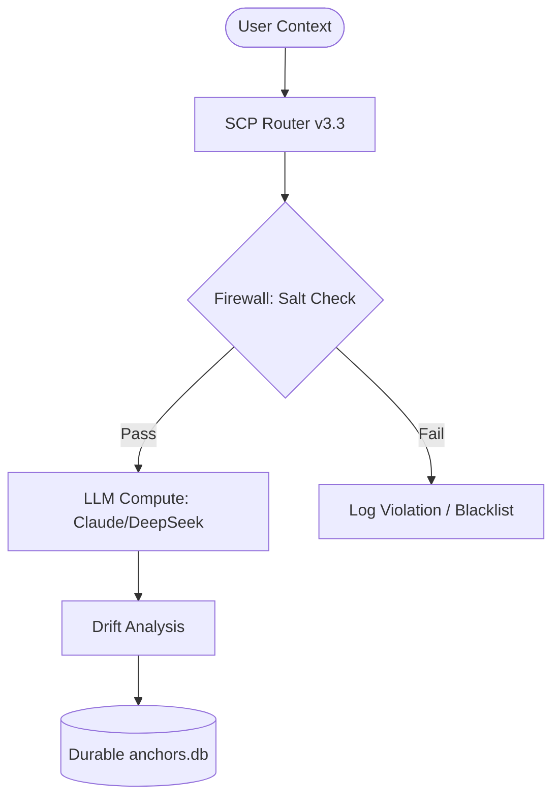

# 🛡️ SCP Router - Hardened Edition (v3.3)
**Secure Semantic Compression Protocol — The Deterministic Memory Layer for AI**


---

## 📌 Overview
The **SCP Router (v3.3 Hardened)** is a deterministic intelligence layer that sits between users and Large Language Models (LLMs). It converts probabilistic AI interactions into a secure, verifiable **Semantic Packet Format (SPF)**. 

Version 3.3 introduces **Persistence Layer Hardening**, ensuring that semantic memory is no longer volatile and is protected by a cryptographic firewall.

### 🧠 Core Philosophy: "Intelligence as Infrastructure"
In SCP v3.3, the AI is treated as a **Compute Engine**, while the Router acts as the **Memory & Logic Engine**. This separation allows for "hot-swappable" intelligence across any model (Claude, DeepSeek, GPT-4) with 100% semantic consistency.

---

## ✨ Key Hardening Features

### 1. SHA256 Salting Engine (L1 Security)
Every anchor tag (e.g., `[WAR]`) is now cryptographically bound to its definition using a **Company Secret Salt**.
*   **Format**: `[CODE:HASH]` (e.g., `[LIQ:bd3d5d48]`)
*   **Defense**: Prevents "Concept Hijacking" and ensures that the AI only uses definitions verified by your organization.

### 2. The 3-Strike Protocol Firewall
The router now enforces a strict behavioral policy:
*   **Monitoring**: Real-time tracking of cryptographic drift and malformed SPF packets.
*   **Sanctions**: Automatic **Session Blacklisting (403 Forbidden)** after three protocol violations.
*   **Safety**: Protects your compute tokens from malfunctioning agents or adversarial steering.

### 3. Durable Global Retention (Omnimodel)
"Experiences" are no longer lost when a session ends.
*   **Discovery**: High-fidelity contexts are autonomously identified in session history.
*   **Commitment**: Users can promote learned keywords to the **Global Registry**.
*   **Availability**: Once committed, this knowledge is instantly available to all users across all supported models.

---

## 🛠️ Architecture



---

## 🚀 Getting Started

### 1. Prerequisites
- Python 3.10+
- `COMPANY_SECRET_SALT` in your `.env` file.
- SQLite3 for the Anchor Registry.

### 2. Installation
```bash
pip install -r requirements.txt
python migrate_hashes.py  # Standardizes DB to v3.3 Salted
```

### 3. Running the Gateway
```bash
python router.py
```
Open **[http://localhost:8000](http://localhost:8000)** to access the Hardened Control Panel.

---

### 4. API Keys and Dry Run
Use your API Keys from the following providers:
- OpenAI: https://platform.openai.com/api-keys
- Anthropic: https://console.anthropic.com/settings/keys
- DeepSeek: https://platform.deepseek.com/api-keys
- Grok: https://platform.x.com/api-keys
- Gemini: https://aistudio.google.com/api-keys
- Copilot: https://copilot.microsoft.com/api-keys


or use the dry run mode to test the router without using any API Keys.

## 📊 Strategic Impact
| Metric | v3.2 (Legacy) | v3.3 (Hardened) |
| :--- | :--- | :--- |
| **Integrity** | Probabilistic | **Deterministic** |
| **Memory** | Volatile | **Durable / Global** |
| **Trust Model** | Open | **Zero-Trust (Salted)** |
| **Accuracy** | halluncination-prone | **Cryptographically Pinpoints** |

---
**Powered by the Semantic Compression Protocol v3.3**
*"The intelligence is in the protocol, not just the model."*
